# Panduan Penggunaan SIWARIS

**SIWARIS — Sistem Informasi Surat Ahli Waris** membantu petugas kelurahan membuat
berkas surat waris: cukup mengisi data satu kali, aplikasi menerbitkan nomor
registrasi dan mencetak **3 surat sekaligus** (Surat Keterangan, Surat Kuasa, dan
Surat Pernyataan Ahli Waris) dalam 3 halaman A4.

> Contoh pada panduan ini memakai Kelurahan **Jaya Mukti (JM)**, Kecamatan
> **Dumai Timur (DT)**, Kota Dumai.

---

## Daftar Isi

1. [Menjalankan Aplikasi](#1-menjalankan-aplikasi)
2. [Login Pertama Kali](#2-login-pertama-kali)
3. [Persiapan Awal (Wajib, Sekali Saja)](#3-persiapan-awal-wajib-sekali-saja)
4. [Membuat Berkas Waris](#4-membuat-berkas-waris)
5. [Melihat Detail & Mengubah Surat Kuasa](#5-melihat-detail--mengubah-surat-kuasa)
6. [Mencetak / Menyimpan PDF](#6-mencetak--menyimpan-pdf)
7. [Mencari Berkas](#7-mencari-berkas)
8. [Melanjutkan Nomor dari Pembukuan Manual](#8-melanjutkan-nomor-dari-pembukuan-manual)
9. [Mengganti Password](#9-mengganti-password)
10. [Pertanyaan yang Sering Muncul](#10-pertanyaan-yang-sering-muncul)

---

## 1. Menjalankan Aplikasi

1. Unduh `siwaris.exe` dari halaman *Releases* (atau minta file-nya ke pengelola),
   lalu klik dua kali.
2. Browser terbuka otomatis ke alamat aplikasi (biasanya `http://localhost:8080`).
3. Seluruh data tersimpan di file `surat-waris.db` **di folder yang sama dengan
   exe** — tidak butuh internet, dan cukup salin folder itu untuk backup.

## 2. Login Pertama Kali

Akun bawaan: username **`admin`**, password **`admin123`**.

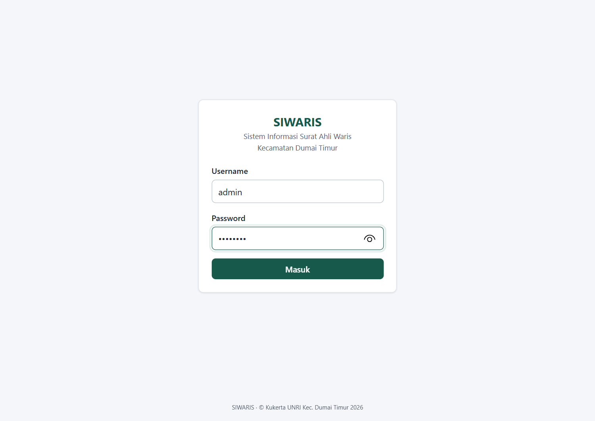

Saat pertama kali masuk, aplikasi **mewajibkan mengganti password** demi
keamanan. Isi password lama (`admin123`), lalu password baru dua kali
(minimal 6 karakter), kemudian klik **Simpan Password**.

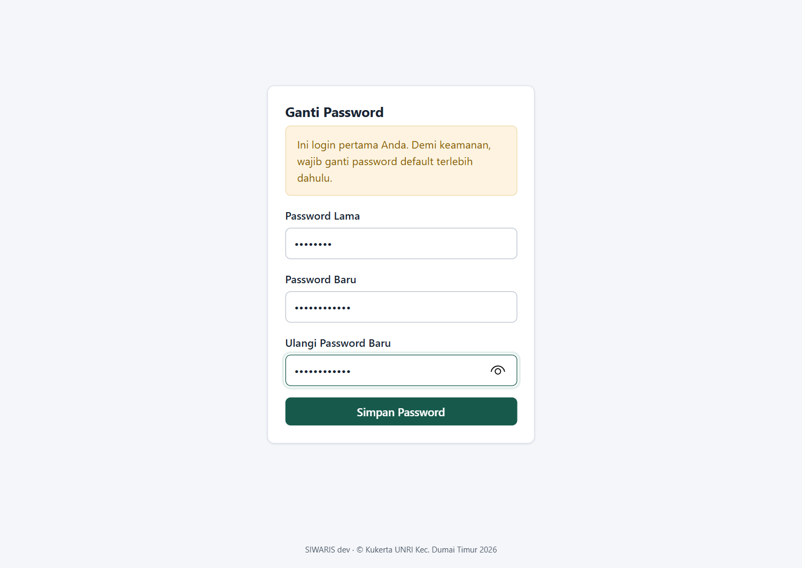

Setelah itu Anda masuk ke halaman **Daftar Berkas** yang masih kosong.

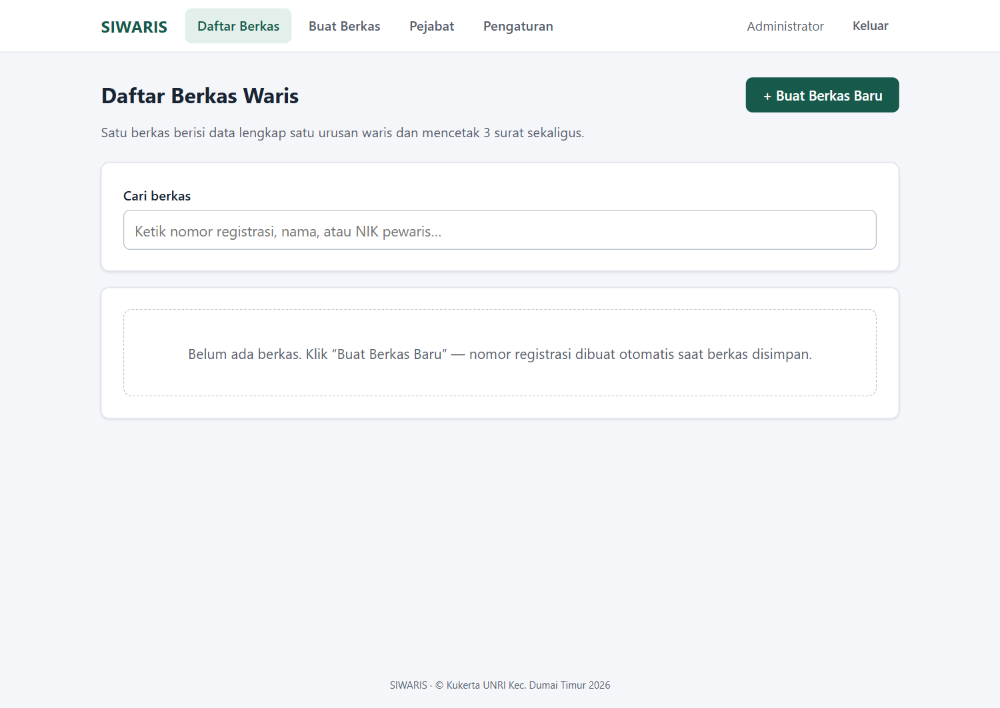

## 3. Persiapan Awal (Wajib, Sekali Saja)

Sebelum berkas pertama bisa dibuat, aplikasi meminta dua hal dilengkapi.
Jika belum, halaman **Buat Berkas** menampilkan daftar periksa seperti ini —
klik tombolnya untuk menuju halaman terkait:

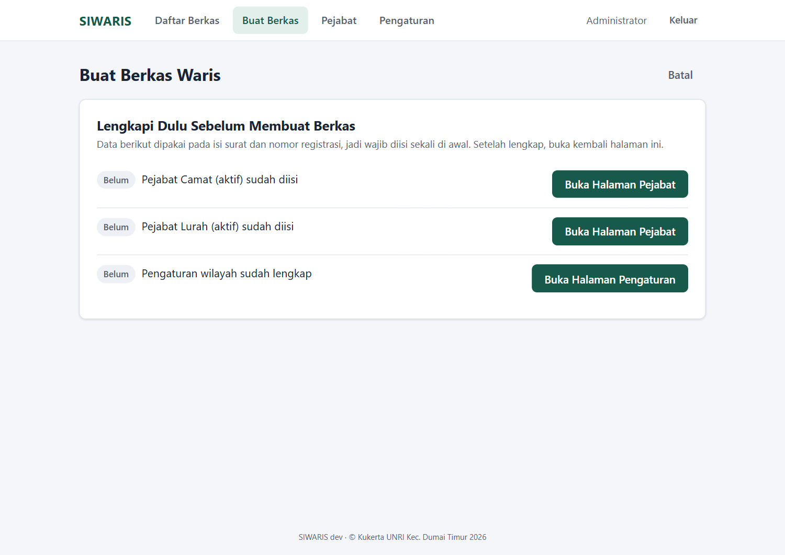

### 3a. Isi Pejabat Penandatangan

Buka menu **Pejabat**. Tambahkan **Camat** dan **Lurah** (nama beserta gelar,
dan NIP) — keduanya dipakai pada blok tanda tangan surat. Pastikan centang
**"Jadikan pejabat aktif"** menyala; hanya satu pejabat aktif per jabatan.

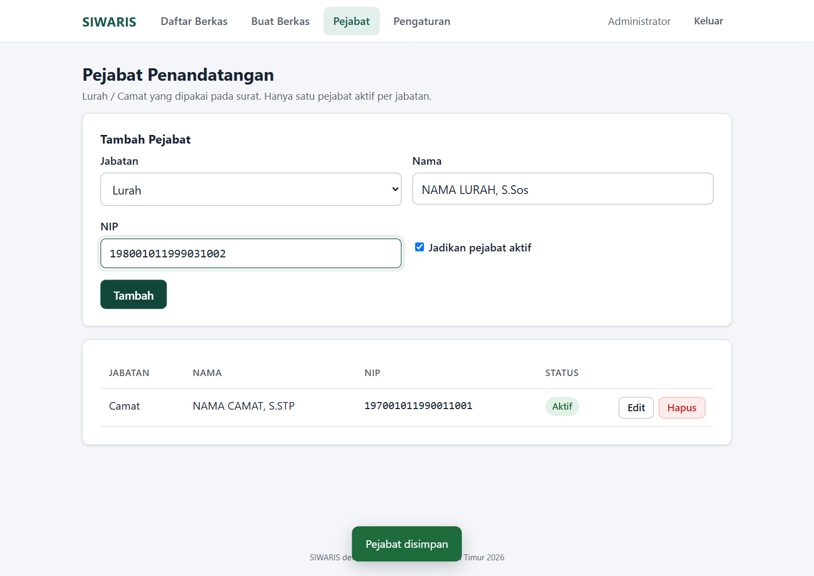

Setelah keduanya ditambahkan, tabel menampilkan status **Aktif**:

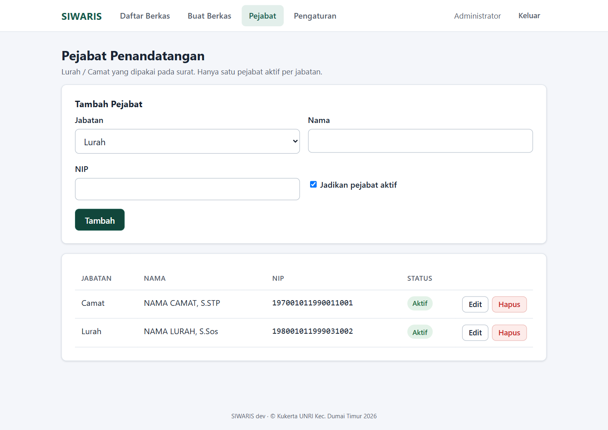

Bila pejabat berganti, tambahkan pejabat baru sebagai aktif — surat yang
dicetak setelahnya otomatis memakai nama baru.

### 3b. Isi Pengaturan Wilayah

Buka menu **Pengaturan**, isi identitas kelurahan (contoh):

| Kolom | Contoh isi |
|---|---|
| Nama Kelurahan | `Jaya Mukti` |
| Kecamatan | `Dumai Timur` |
| Kota | `Dumai` |
| Kode Kecamatan | `DT` |
| Kode Kelurahan | `JM` |
| Instansi Penerbit Surat Kematian | *(sudah terisi otomatis:* `Dinas Kependudukan dan Pencatatan Sipil Kota Dumai`*)* |

Kode dipakai untuk nomor registrasi, contohnya `12/SKAW/DT/2026` (Camat) dan
`12/SKAW/JM-DT/2026` (Lurah). Klik **Simpan Pengaturan**.

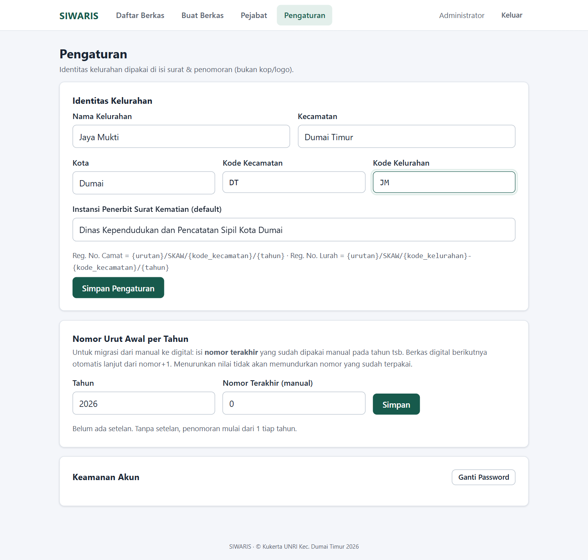

## 4. Membuat Berkas Waris

Buka menu **Buat Berkas**. Formulir berbentuk **6 langkah berurutan** — isian
tidak hilang saat berpindah langkah, dan lingkaran langkah yang sudah selesai
(✓) bisa diklik untuk kembali.

### Langkah 1 — Data Berkas

Tanggal yang akan tercetak pada surat, dan alamat tempat tinggal terakhir
almarhum/almarhumah.

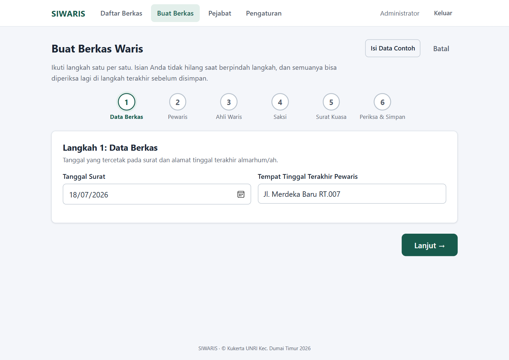

### Langkah 2 — Pewaris (yang meninggal)

Data almarhum/almarhumah: nama, NIK, status (suami/istri), tanggal meninggal,
serta nomor & tanggal surat kematiannya. Bisa 1 orang, atau 2 bila pasangan
suami-istri sudah sama-sama meninggal (klik **+ Tambah Pewaris**).

Kolom *Instansi Penerbit Surat Kematian* boleh dikosongkan — otomatis diisi
instansi dari Pengaturan.

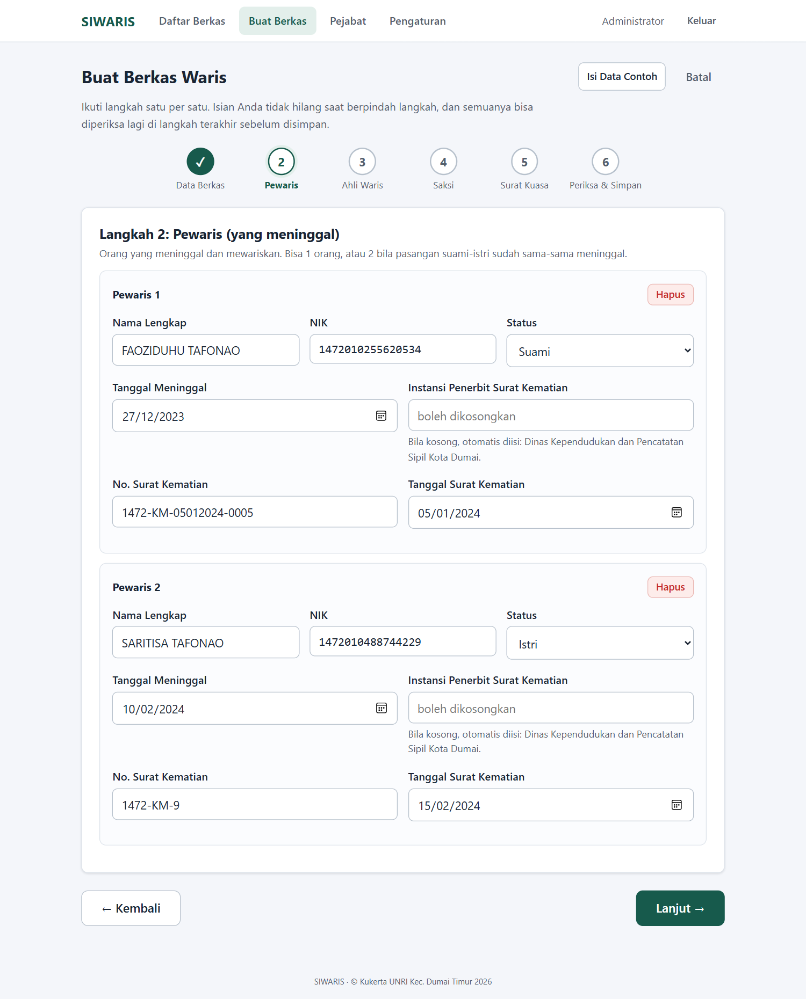

### Langkah 3 — Ahli Waris

Semua penerima waris, sesuai urutan yang akan tercetak di tabel surat.
Klik **+ Tambah Ahli Waris** sesuai jumlahnya. Kolom *Hubungan dengan
Pewaris* diisi misalnya `Anak`.

> **Perhatian:** NIK pewaris hanya bisa dibuatkan berkas **satu kali**.
> Ini pengaman agar tidak ada surat waris ganda.

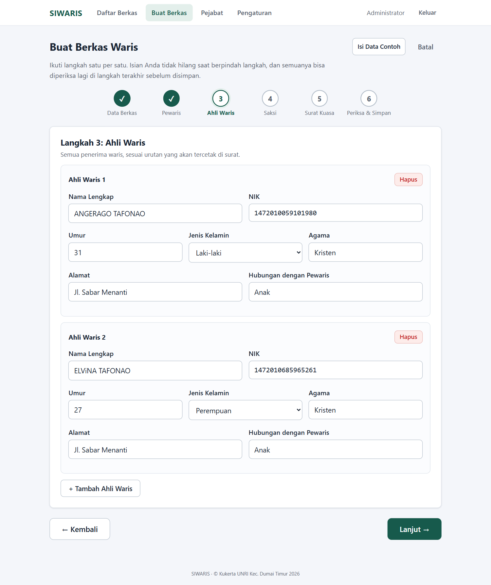

### Langkah 4 — Saksi

Tepat **2 orang** saksi yang ikut menandatangani surat.

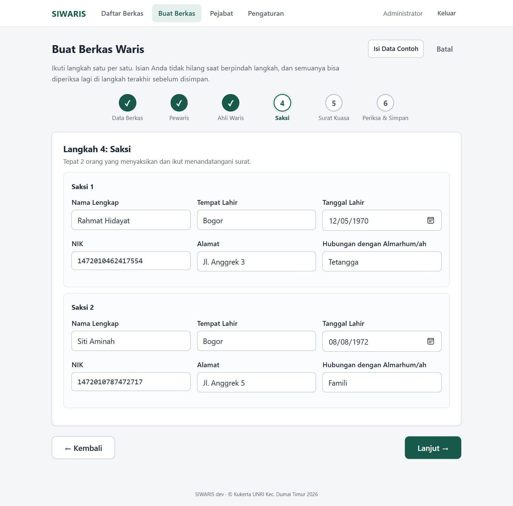

### Langkah 5 — Surat Kuasa

Pilih **satu ahli waris sebagai penerima kuasa**; ahli waris lainnya otomatis
menjadi pemberi kuasa. Lengkapi data pelengkap penerima kuasa (tempat/tanggal
lahir, pekerjaan) — ini tercetak di Surat Kuasa. Lalu tuliskan
**urusan yang dikuasakan** apa adanya, persis seperti akan tercetak
(contoh: pengurusan BPJS, tabungan bank, balik nama, dll). Bagian ini masih
bisa diubah kapan saja setelah berkas disimpan.

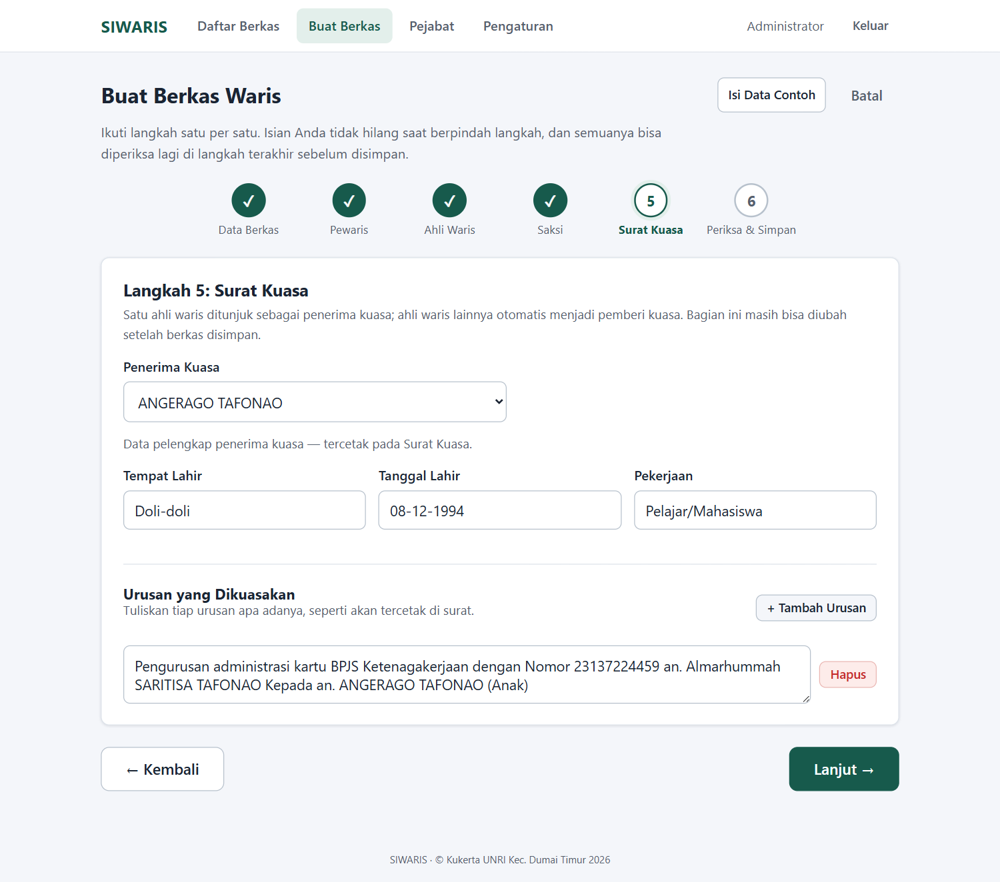

### Langkah 6 — Periksa & Simpan

Semua isian dirangkum. Periksa baik-baik; klik **Ubah** untuk kembali ke
langkah terkait.

> **Penting:** setelah klik **Simpan Berkas**, nomor registrasi Camat & Lurah
> langsung terbit dan data **terkunci** (tidak bisa diedit) — kecuali bagian
> Surat Kuasa. Kalau ada salah ketik, perbaiki **sebelum** menyimpan.

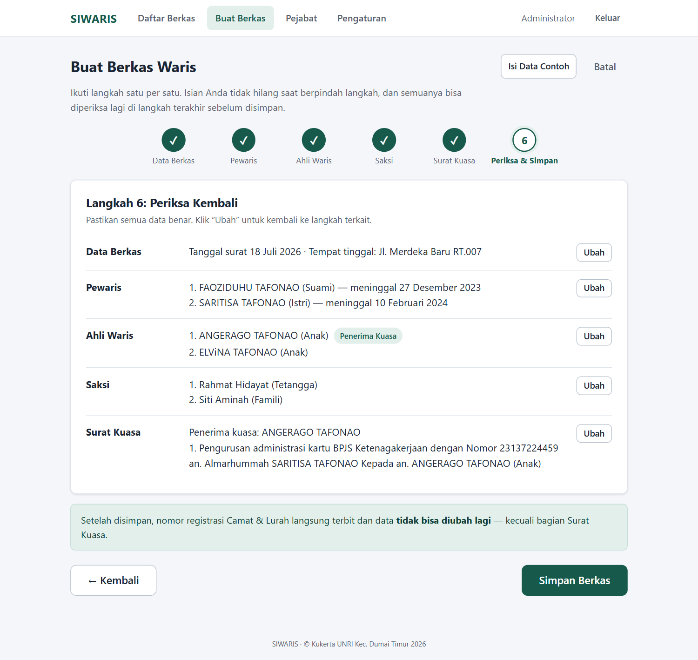

## 5. Melihat Detail & Mengubah Surat Kuasa

Setelah tersimpan, halaman detail menampilkan kedua nomor registrasi, daftar
3 surat yang dihasilkan, dan seluruh data berkas. Kartu bertanda 🔒 **Terkunci**
tidak bisa diubah; kartu **Surat Kuasa** (berbingkai hijau, bertanda
"Masih dapat diubah") tetap bisa: ganti penerima kuasa, data pelengkapnya,
serta tambah/ubah/hapus urusan kuasa. Perubahan langsung ikut pada cetakan
berikutnya.

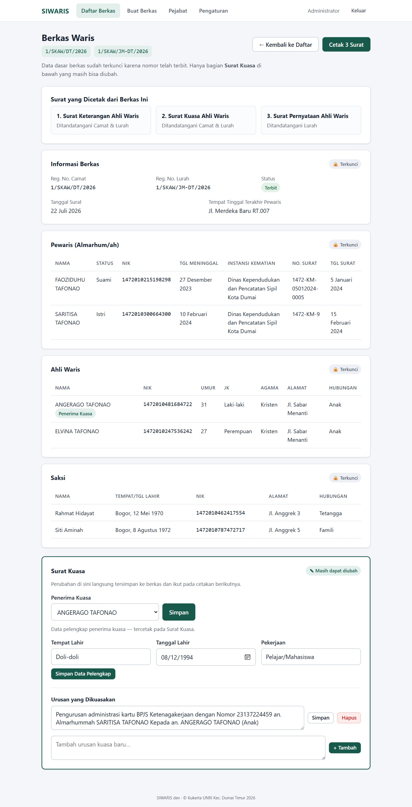

## 6. Mencetak / Menyimpan PDF

Dari halaman detail, klik **Cetak 3 Surat**. Tab baru terbuka menampilkan
pratinjau ketiga surat, lengkap dengan teks hukum, tabel ahli waris, saksi,
dan blok tanda tangan.

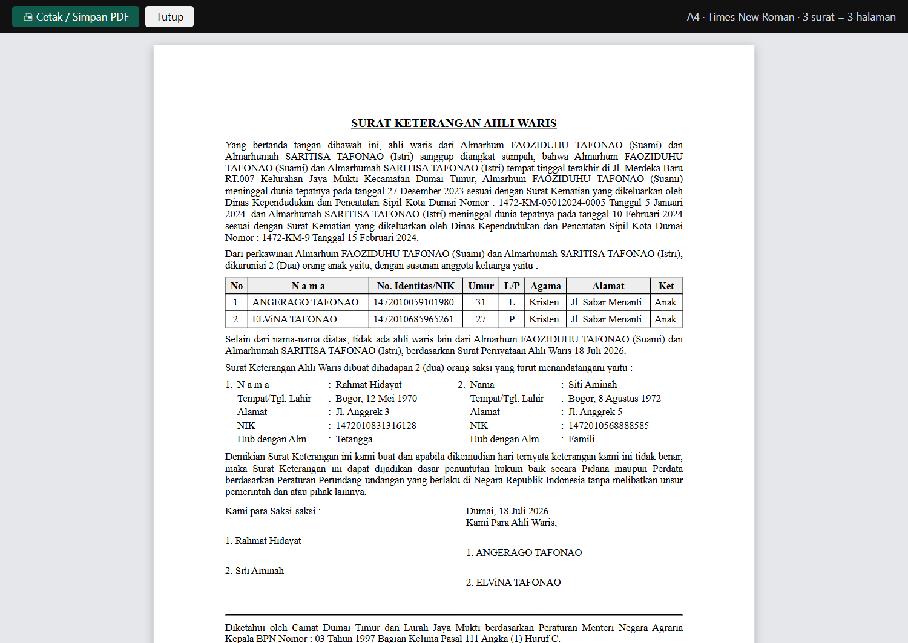

- Klik **🖨 Cetak / Simpan PDF**, atau tekan `Ctrl+P`.
- Kertas **A4**, hasil cetak **tepat 3 halaman** (1 surat = 1 halaman).
- Untuk menyimpan sebagai file, pilih printer **"Save as PDF"** di dialog cetak.
- Pada dialog cetak, pastikan skala **100%** (bukan "Fit to page") dan ukuran
  kertas A4.

## 7. Mencari Berkas

Di halaman **Daftar Berkas**, ketik pada kolom pencarian: nomor registrasi,
nama, atau NIK pewaris. Hasil tersaring otomatis. Klik **Buka** untuk melihat
detail berkas.

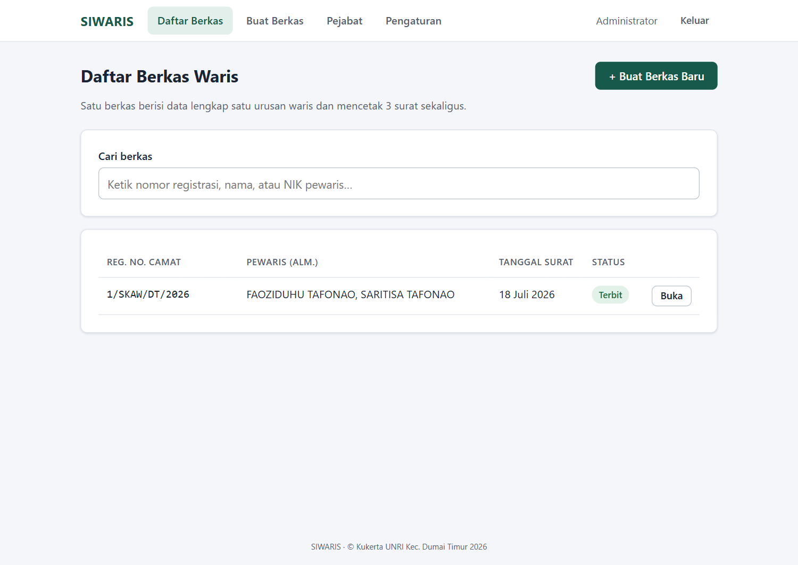

## 8. Melanjutkan Nomor dari Pembukuan Manual

Bila sebelumnya penomoran dilakukan manual di buku register, buka
**Pengaturan → Nomor Urut Awal per Tahun**: isi tahun berjalan dan **nomor
terakhir yang sudah terpakai** di buku. Berkas digital berikutnya otomatis
melanjutkan dari nomor itu + 1. Tanpa setelan ini, penomoran mulai dari 1
di tiap tahun.

## 9. Mengganti Password

**Pengaturan → Keamanan Akun → Ganti Password.** Isi password lama dan
password baru dua kali.

## 10. Pertanyaan yang Sering Muncul

**Kenapa tombol simpan berkas ditolak dengan pesan "Pejabat ... belum diisi"?**
Prasyarat belum lengkap — lihat [bagian 3](#3-persiapan-awal-wajib-sekali-saja).

**Kenapa muncul "NIK pewaris sudah pernah dibuatkan berkas"?**
Setiap NIK pewaris hanya boleh satu berkas (pengaman surat ganda). Cari berkas
lamanya lewat pencarian NIK, lalu pakai/cetak ulang berkas tersebut.

**Data salah ketik tapi berkas sudah tersimpan, bagaimana?**
Data dasar terkunci setelah nomor terbit. Yang masih bisa diubah hanya bagian
Surat Kuasa. Untuk kesalahan pada data dasar, buat kebijakan koreksi sesuai
prosedur kantor (berkas lama tetap tercatat di aplikasi).

**Hasil cetak lebih dari 3 halaman?**
Pastikan ukuran kertas di dialog cetak = A4 dan skala 100%. Berkas dengan
ahli waris sangat banyak memang bisa meluber ke halaman tambahan — pemecahan
halamannya tetap rapi (tabel/tanda tangan tidak terpotong).

**Bagaimana backup data?**
Tutup aplikasi, lalu salin file `surat-waris.db` (satu folder dengan exe) ke
tempat aman. Memulihkan = menaruh kembali file itu di samping exe.

---

*Dokumentasi ini dibuat otomatis dengan skrip Playwright terhadap aplikasi
versi terbaru; seluruh screenshot diambil dari alur nyata pada database baru.*
