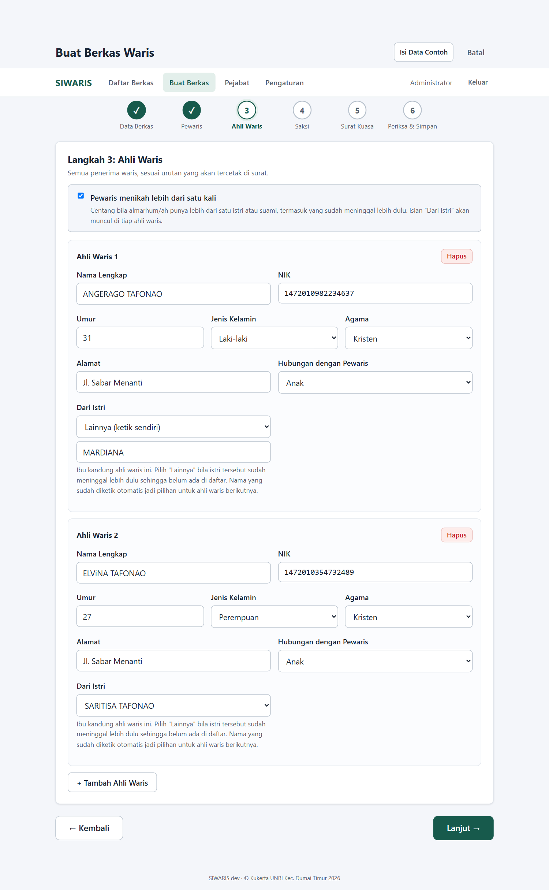
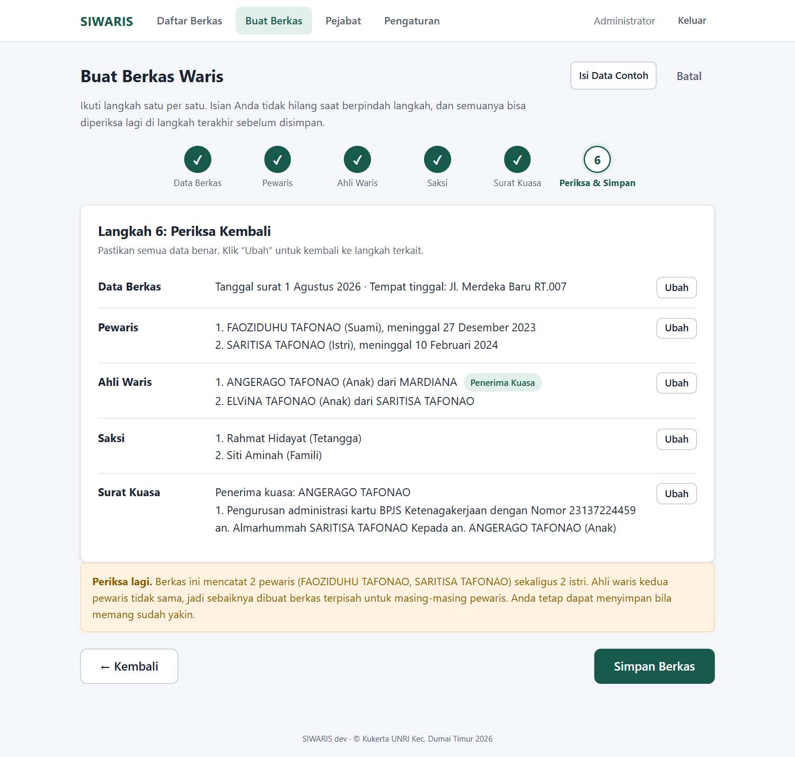
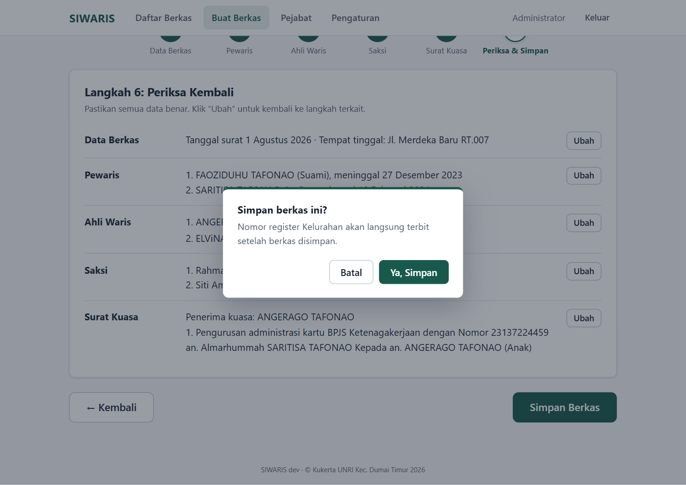

# Panduan Penggunaan SIWARIS

**SIWARIS (Sistem Informasi Surat Ahli Waris)** membantu petugas kelurahan membuat
berkas surat waris: cukup mengisi data satu kali, aplikasi menerbitkan nomor
registrasi dan mencetak **3 surat sekaligus** (Surat Keterangan, Surat Kuasa, dan
Surat Pernyataan Ahli Waris) di kertas A4, tiap surat mulai di halaman baru.

> Contoh pada panduan ini memakai Kelurahan **Jaya Mukti (JM)**, Kecamatan
> **Dumai Timur (DT)**, Kota Dumai.

---

## Daftar Isi

1. [Menjalankan Aplikasi](#1-menjalankan-aplikasi)
2. [Login Pertama Kali](#2-login-pertama-kali)
3. [Persiapan Awal (Wajib, Sekali Saja)](#3-persiapan-awal-wajib-sekali-saja)
4. [Membuat Berkas Waris](#4-membuat-berkas-waris)
5. [Satu Berkas untuk Siapa? (Pewaris, Istri Lebih dari Satu)](#5-satu-berkas-untuk-siapa-pewaris-istri-lebih-dari-satu)
6. [Melihat Detail & Merevisi Berkas](#6-melihat-detail--merevisi-berkas)
7. [Mencetak / Menyimpan PDF](#7-mencetak--menyimpan-pdf)
8. [Mencari Berkas & Ekspor ke Excel](#8-mencari-berkas--ekspor-ke-excel)
9. [Melanjutkan Nomor dari Pembukuan Manual](#9-melanjutkan-nomor-dari-pembukuan-manual)
10. [Cadangan & Pindah Data (Pindah Komputer)](#10-cadangan--pindah-data-pindah-komputer)
11. [Pembaruan Aplikasi Otomatis](#11-pembaruan-aplikasi-otomatis)
12. [Mengganti Password](#12-mengganti-password)
13. [Pertanyaan yang Sering Muncul](#13-pertanyaan-yang-sering-muncul)

---

## 1. Menjalankan Aplikasi

1. Unduh `siwaris.exe` dari halaman *Releases* (atau minta file-nya ke pengelola),
   lalu klik dua kali.
2. Browser terbuka otomatis ke alamat aplikasi (biasanya `http://localhost:8080`).
3. Seluruh data tersimpan di file `surat-waris.db` **di folder yang sama dengan
   exe** dan tidak butuh internet. Untuk backup atau pindah komputer, pakai
   fitur bawaan di [bagian 10](#10-cadangan--pindah-data-pindah-komputer).

## 2. Login Pertama Kali

Akun bawaan: username **`admin`**, password **`admin123`**.

Saat pertama kali masuk, aplikasi **mewajibkan mengganti password** demi
keamanan. Isi password lama (`admin123`), lalu password baru dua kali
(minimal 6 karakter), kemudian klik **Simpan Password**.

Setelah itu Anda masuk ke halaman **Daftar Berkas** yang masih kosong.

## 3. Persiapan Awal (Wajib, Sekali Saja)

Sebelum berkas pertama bisa dibuat, aplikasi meminta dua hal dilengkapi.
Jika belum, halaman **Buat Berkas** menampilkan daftar periksa seperti ini;
klik tombolnya untuk menuju halaman terkait:

### 3a. Isi Pejabat Penandatangan

Buka menu **Pejabat**. Tambahkan **Camat** dan **Lurah** (nama beserta gelar,
dan NIP); keduanya dipakai pada blok tanda tangan surat. Pastikan centang
**"Jadikan pejabat aktif"** menyala; hanya satu pejabat aktif per jabatan.

Setelah keduanya ditambahkan, tabel menampilkan status **Aktif**:

Bila pejabat berganti, tambahkan pejabat baru sebagai aktif; surat yang
dicetak setelahnya otomatis memakai nama baru.

### 3b. Isi Pengaturan Wilayah

Buka menu **Pengaturan**, isi identitas kelurahan (contoh):

| Kolom | Contoh isi |
|---|---|
| Nama Kelurahan | `Jaya Mukti` |
| Kecamatan | `Dumai Timur` |
| Kota | `Dumai` |
| Kode Kecamatan | `DT` |
| Kode Kelurahan | `JM` |
| Instansi Penerbit Surat Kematian | *(sudah terisi otomatis:* `Dinas Kependudukan dan Pencatatan Sipil Kota Dumai`*)* |

Kode dipakai untuk nomor registrasi Kelurahan, contohnya `12/SKAW/JM-DT/2026`,
dengan tanggal register otomatis mengikuti tanggal surat. Nomor register Camat
tercetak `.../SKAW/DT/2026` dengan tanggal titik-titik; nomor urut dan
tanggalnya sengaja dikosongkan untuk **diisi tulis tangan oleh pihak
kecamatan**. Klik **Simpan Pengaturan**.

## 4. Membuat Berkas Waris

Buka menu **Buat Berkas**. Formulir berbentuk **6 langkah berurutan**; isian
tidak hilang saat berpindah langkah, dan lingkaran langkah yang sudah selesai
(✓) bisa diklik untuk kembali.

### Langkah 1: Data Berkas

Tanggal yang akan tercetak pada surat, dan alamat tempat tinggal terakhir
almarhum/almarhumah.

### Langkah 2: Pewaris (yang meninggal)

Data almarhum/almarhumah: nama, NIK, status (suami/istri), tanggal meninggal,
serta nomor & tanggal surat kematiannya. Bisa 1 orang, atau 2 bila pasangan
suami-istri sudah sama-sama meninggal (klik **+ Tambah Pewaris**).

Kolom *Instansi Penerbit Surat Kematian* boleh dikosongkan, otomatis diisi
instansi dari Pengaturan.

### Langkah 3: Ahli Waris

Semua penerima waris, sesuai urutan yang akan tercetak di tabel surat.
Klik **+ Tambah Ahli Waris** sesuai jumlahnya.

*Hubungan dengan Pewaris* dipilih dari daftar: **Anak, Istri, Suami, Ayah, Ibu,
Saudara Kandung, Cucu**. Bila hubungannya tidak ada di daftar, pilih
**Lainnya (ketik sendiri)** lalu ketik sendiri, misalnya `Keponakan`.

> **Pasangan yang masih hidup ikut di sini.** Istri atau suami yang belum
> meninggal adalah **ahli waris**, bukan pewaris. Isi namanya sebagai ahli waris
> dengan Hubungan `Istri` atau `Suami`. Dia ikut tabel dan ikut menandatangani
> surat, tetapi tidak dihitung pada kalimat "dikaruniai sekian orang anak".

**Bila pewaris menikah lebih dari satu kali**, centang kotak
**"Pewaris menikah lebih dari satu kali"** di atas daftar. Setiap ahli waris
akan mendapat isian **Dari Istri**, yaitu ibu kandungnya. Pilih dari daftar
nama istri yang sudah diketik; kalau istri tersebut sudah meninggal lebih dulu
sehingga belum ada di daftar, pilih **Lainnya (ketik sendiri)** lalu ketik
namanya. Nama yang sudah diketik langsung ikut jadi pilihan untuk ahli waris
berikutnya, jadi cukup sekali mengetik.

Kalau *Dari Istri* terisi untuk dua istri yang berbeda, surat otomatis
menambah kolom **Dari Istri** pada tabel dan kalimatnya berubah menjadi
*"Semasa hidupnya Almarhum ... telah menikah dengan A dan B, dari perkawinan
tersebut dikaruniai sekian orang anak"*. Bila hanya satu istri, surat tercetak
seperti biasa tanpa kolom tambahan.

> **Perhatian:** NIK pewaris hanya bisa dibuatkan berkas **satu kali**.
> Ini pengaman agar tidak ada surat waris ganda.

Tampilan setelah centang "Pewaris menikah lebih dari satu kali" diaktifkan dan
*Dari Istri* terisi:

### Langkah 4: Saksi

Tepat **2 orang** saksi yang ikut menandatangani surat.

### Langkah 5: Surat Kuasa

Pilih **satu ahli waris sebagai penerima kuasa**; ahli waris lainnya otomatis
menjadi pemberi kuasa. Lengkapi data pelengkap penerima kuasa (tempat/tanggal
lahir, pekerjaan); ini tercetak di Surat Kuasa. Lalu tuliskan
**urusan yang dikuasakan** apa adanya, persis seperti akan tercetak
(contoh: pengurusan BPJS, tabungan bank, balik nama, dll).

### Langkah 6: Periksa & Simpan

Semua isian dirangkum. Periksa baik-baik; klik **Ubah** untuk kembali ke
langkah terkait.

Bila berkas mencatat **2 pewaris sekaligus lebih dari satu istri**, muncul
kotak peringatan kuning. Berkas seperti itu sebaiknya dipisah; penjelasannya
ada di [bagian 5](#5-satu-berkas-untuk-siapa-pewaris-istri-lebih-dari-satu).
Peringatan ini tidak menghalangi, berkas tetap bisa disimpan bila petugas
sudah yakin.

Saat klik **Simpan Berkas**, muncul jendela konfirmasi; klik **Ya, Simpan**
dan nomor registrasi Kelurahan langsung terbit. Tidak perlu khawatir salah
ketik: **semua data masih bisa direvisi** kapan saja lewat tombol
**Ubah Berkas** di halaman detail (nomor register tidak berubah).

## 5. Satu Berkas untuk Siapa? (Pewaris, Istri Lebih dari Satu)

Bagian ini menentukan **isi** surat, bukan cara menekan tombol. Sebaiknya
dibaca sekali sebelum mulai melayani.

**Warisan terbuka per orang yang meninggal.** Setiap almarhum/almarhumah punya
daftar ahli warisnya sendiri. Karena itu satu berkas pada dasarnya untuk
**satu pewaris**, dan pasangan yang masih hidup masuk sebagai **ahli waris**.

Aplikasi mengizinkan **2 pewaris** dalam satu berkas karena blangko kecamatan
memang menyediakannya. Penggabungan itu **hanya sah bila daftar ahli waris
kedua pewaris sama persis**, yaitu suami dan istri yang sama-sama meninggal,
menikah sekali, dan seluruh ahli warisnya anak dari perkawinan itu. Hasilnya
sama saja, jadi tidak perlu dua kali kerja.

**Begitu istrinya lebih dari satu, daftar itu tidak lagi sama:**

| Pewaris | Ahli warisnya |
|---|---|
| Suami | istri yang masih hidup + **semua** anak dari kedua istri |
| Istri pertama (bila juga meninggal) | **hanya** anak-anak dari istri pertama |

Kalau keduanya digabung jadi satu berkas, surat akan menyatakan anak dari istri
kedua sebagai ahli waris istri pertama. Itu tidak benar dan berpotensi ditolak
atau menjadi sengketa di BPN maupun bank.

### Tabel cara input

| Yang meninggal | Cara input |
|---|---|
| Suami saja, istri satu | **1 berkas, 1 pewaris.** Istri masuk sebagai ahli waris `Istri`. |
| Suami saja, istri dua | **1 berkas, 1 pewaris.** Kedua istri masuk sebagai ahli waris `Istri`, tiap anak diberi *Dari Istri*. |
| Suami dan istri, hanya sekali nikah | **1 berkas, 2 pewaris.** Sah, karena ahli warisnya sama. |
| Suami dan salah satu istri, sedangkan istrinya dua | **2 berkas terpisah.** Satu untuk suami, satu untuk istri yang meninggal. |
| Suami dan kedua istri | **3 berkas terpisah**, dengan alasan yang sama. |

Membuat berkas terpisah aman: kunci NIK hanya melarang satu NIK menjadi
**pewaris** dua kali, sedangkan orang yang sama boleh menjadi ahli waris di
berkas mana pun. Tiap berkas mendapat nomor registrasinya sendiri.

### Contoh berkas terpisah

Almarhum ZAINAL ABIDIN punya dua istri: HALIMAH (meninggal lebih dulu) dan
NURHAYATI (masih hidup). Dari HALIMAH ada 2 anak, dari NURHAYATI ada 1 anak.

- **Berkas 1, pewaris ZAINAL ABIDIN.** Ahli waris: NURHAYATI (`Istri`) dan
  ketiga anak. Centang "menikah lebih dari satu kali", isi *Dari Istri* dengan
  HALIMAH atau NURHAYATI sesuai ibunya. Nama HALIMAH diketik lewat pilihan
  **Lainnya** karena dia tidak ada di daftar.
- **Berkas 2, pewaris HALIMAH.** Ahli waris: **hanya 2 anaknya sendiri**.
  NURHAYATI dan anaknya tidak ikut.

## 6. Melihat Detail & Merevisi Berkas

Setelah tersimpan, halaman detail menampilkan kedua nomor registrasi, daftar
3 surat yang dihasilkan, dan seluruh data berkas. Bila *Dari Istri* terpakai,
tabel ahli waris ikut menampilkan kolomnya.

Berkas yang mencatat 2 pewaris sekaligus lebih dari satu istri diberi kotak
peringatan kuning di bagian atas halaman ini, termasuk berkas lama yang dibuat
sebelum aturan itu diberlakukan. Lihat
[bagian 5](#5-satu-berkas-untuk-siapa-pewaris-istri-lebih-dari-satu).

**Semua data berkas dapat direvisi.** Klik **Ubah Berkas**: formulir
6 langkah yang sama terbuka dengan seluruh isian lama, silakan perbaiki lalu
klik **Simpan Revisi** di langkah terakhir (ada jendela konfirmasi sebelum
data lama diganti). Nomor register tidak berubah, dan cetakan berikutnya
otomatis memakai data baru.

Khusus bagian **Surat Kuasa** (kartu berbingkai hijau di bawah halaman detail)
juga bisa diubah cepat tanpa membuka formulir: ganti penerima kuasa, data
pelengkapnya, serta tambah/ubah/hapus urusan kuasa.

## 7. Mencetak / Menyimpan PDF

Dari halaman detail, klik **Cetak 3 Surat**. Tab baru terbuka menampilkan
pratinjau ketiga surat, lengkap dengan teks hukum, tabel ahli waris, saksi,
dan blok tanda tangan.

- Klik **Cetak / Simpan PDF**, atau tekan `Ctrl+P`.
- Kertas **A4**. Tiap surat selalu mulai di halaman baru, jadi berkas dengan
  ahli waris sedikit menghasilkan **3 halaman**. Bila ahli warisnya banyak,
  suatu surat bisa memakai 2 lembar; itu wajar, lihat FAQ di bagian akhir.
- Untuk menyimpan sebagai file, pilih printer **"Save as PDF"** di dialog cetak.
- Pada dialog cetak, pastikan skala **100%** (bukan "Fit to page") dan ukuran
  kertas A4.

Pada blok tanda tangan, kolom **Camat** tercetak dengan nomor register dan
tanggal titik-titik (`.../SKAW/DT/2026`) untuk diisi tulis tangan oleh pihak
kecamatan; kolom **Lurah** sudah lengkap dengan nomor dan tanggal otomatis.

### Materai

Di kolom tanda tangan para ahli waris tercetak satu kotak bergaris bertuliskan
**MATERAI Rp10.000,-**, sejajar di samping deretan nama. Tempelkan **satu
materai** di kotak itu pada tiap surat, lalu tanda tangan salah satu ahli waris
mengenai materainya. Bukan satu materai untuk tiap orang.

Pada Surat Kuasa, kotak materai berada di kolom **Yang Memberi Kuasa (PIHAK
II)**.

### Blok tanda tangan tidak terbelah

Bila isi surat panjang, seluruh blok tanda tangan (saksi, ahli waris, dan
pejabat) berpindah **utuh** ke halaman berikutnya, tidak terpotong di tengah.
Akibatnya halaman sebelumnya bisa terlihat kosong di bagian bawah. Itu memang
disengaja supaya tidak ada nama yang terpisah dari kolom tanda tangannya.
Di bagian paling bawah tiap halaman ada baris kecil penanda bahwa dokumen
dicetak melalui aplikasi SIWARIS, beserta nomor register dan tanggal cetaknya.

## 8. Mencari Berkas & Ekspor ke Excel

Di halaman **Daftar Berkas**, ketik pada kolom pencarian: nomor registrasi,
nama, atau NIK pewaris. Hasil tersaring otomatis. Klik **Buka** untuk melihat
detail berkas.

Klik **Ekspor Excel** (di samping tombol Buat Berkas Baru) untuk mengunduh
daftar berkas sebagai file `siwaris-daftar-berkas-<tanggal>.xlsx`, berisi
kolom nomor registrasi, tanggal register, nama dan NIK pewaris, tanggal
surat, alamat, dan status. Bila kolom pencarian sedang terisi, yang diekspor
hanya hasil pencarian itu. NIK dan nomor registrasi tersimpan sebagai teks
sehingga digitnya tidak berubah di Excel.

## 9. Melanjutkan Nomor dari Pembukuan Manual

Bila sebelumnya penomoran dilakukan manual di buku register, buka
**Pengaturan → Nomor Urut Awal per Tahun**: isi tahun berjalan dan **nomor
terakhir yang sudah terpakai** di buku. Berkas digital berikutnya otomatis
melanjutkan dari nomor itu + 1. Tanpa setelan ini, penomoran mulai dari 1
di tiap tahun.

## 10. Cadangan & Pindah Data (Pindah Komputer)

Buka **Pengaturan → Cadangan & Pindah Data**.

**Membuat cadangan:** klik **Unduh Cadangan (.db)**. Seluruh data (berkas,
pejabat, pengaturan, akun) terunduh sebagai satu file
`siwaris-cadangan-<tanggal>.db`. Simpan file ini di flashdisk atau tempat
aman; aplikasi tidak perlu ditutup dulu. Biasakan mengunduh cadangan secara
berkala, misalnya tiap akhir minggu.

**Pindah komputer:**

1. Di komputer lama: klik **Unduh Cadangan (.db)**, salin file hasil unduhan
   ke flashdisk bersama `siwaris.exe`.
2. Di komputer baru: jalankan `siwaris.exe`, login, lengkapi ganti password.
3. Buka **Pengaturan → Cadangan & Pindah Data**, klik
   **Impor dari File Cadangan**, pilih file cadangan tadi, lalu konfirmasi
   **Ya, Impor & Ganti Data**.
4. Aplikasi memuat ulang dan meminta login dengan **akun dari data yang
   diimpor** (username dan password yang dipakai di komputer lama).

**Catatan aman:** impor mengganti seluruh data yang sedang ada. Sebelum
mengganti, aplikasi otomatis menyimpan data lama ke file
`siwaris-backup-sebelum-impor-<waktu>.db` di folder aplikasi, jadi selalu
bisa dikembalikan dengan mengimpor file backup itu. File yang bukan hasil
ekspor SIWARIS akan ditolak.

## 11. Pembaruan Aplikasi Otomatis

Saat dibuka dan komputer sedang terhubung internet, aplikasi mengecek apakah
ada versi baru. Bila ada, muncul strip kuning di bagian atas:
**"Versi baru vX.Y.Z tersedia"** dengan tombol **Perbarui Sekarang**.

Klik tombolnya, konfirmasi, lalu tunggu; aplikasi mengunduh versi baru,
memasangnya, menyalakan ulang dirinya sendiri, dan halaman memuat ulang
otomatis. Seluruh data tetap utuh. Tanpa internet, aplikasi tetap berjalan
normal seperti biasa, hanya tidak bisa mengecek versi baru.

Pengaman tambahan di balik layar:

- Bila versi baru mengubah struktur database, salinan data lama disimpan
  otomatis sebagai `surat-waris-pra-migrasi-v<N>.db` di folder aplikasi
  sebelum perubahan dijalankan.
- Bila `siwaris.exe` versi lama dijalankan terhadap data yang sudah dipakai
  versi lebih baru, aplikasi menolak berjalan dan menampilkan penjelasan
  (mencegah kerusakan data). Solusinya: jalankan versi terbaru, atau impor
  file pra-migrasi di atas bila memang ingin kembali ke versi lama.

## 12. Mengganti Password

**Pengaturan → Keamanan Akun → Ganti Password.** Isi password lama dan
password baru dua kali.

## 13. Pertanyaan yang Sering Muncul

**Kenapa tombol simpan berkas ditolak dengan pesan "Pejabat ... belum diisi"?**
Prasyarat belum lengkap, lihat [bagian 3](#3-persiapan-awal-wajib-sekali-saja).

**Kenapa muncul "NIK pewaris sudah pernah dibuatkan berkas"?**
Setiap NIK pewaris hanya boleh satu berkas (pengaman surat ganda). Cari berkas
lamanya lewat pencarian NIK, lalu pakai/cetak ulang berkas tersebut.

**Data salah ketik tapi berkas sudah tersimpan, bagaimana?**
Buka berkasnya lalu klik **Ubah Berkas**; semua data bisa diperbaiki dan
disimpan ulang; nomor register tidak berubah
(lihat [bagian 6](#6-melihat-detail--merevisi-berkas)).

**Hasil cetak lebih dari 3 halaman?**
Pastikan ukuran kertas di dialog cetak = A4 dan skala 100%. Kalau sudah benar
tapi tetap lebih, berarti isinya memang tidak muat: berkas dengan ahli waris
banyak membuat blok tanda tangan pindah utuh ke lembar berikutnya. Itu
disengaja supaya tidak ada nama yang terpisah dari kolom tanda tangannya, jadi
halaman sebelumnya boleh terlihat kosong di bagian bawah.

**Kenapa jumlah "orang anak" di surat berkurang dibanding cetakan lama?**
Istri atau suami yang terdaftar sebagai ahli waris sekarang tidak lagi ikut
dihitung sebagai anak. Contohnya berkas dengan 1 istri dan 3 anak: dulu
tertulis 4 orang anak, sekarang 3. Yang sekarang ini yang benar.

**Ahli waris punya ibu yang berbeda, bagaimana menuliskannya?**
Centang **"Pewaris menikah lebih dari satu kali"** di Langkah 3, lalu isi
**Dari Istri** pada tiap ahli waris. Lihat
[bagian 5](#5-satu-berkas-untuk-siapa-pewaris-istri-lebih-dari-satu).

**Muncul kotak kuning "Periksa lagi ... 2 pewaris sekaligus 2 istri".**
Berkas itu menggabungkan dua pewaris yang ahli warisnya tidak sama. Sebaiknya
dipecah menjadi berkas terpisah untuk masing-masing pewaris; penjelasan dan
contohnya ada di
[bagian 5](#5-satu-berkas-untuk-siapa-pewaris-istri-lebih-dari-satu).

**Berapa materai yang perlu ditempel?**
Satu materai Rp10.000 per surat, di kotak yang sudah tercetak pada kolom tanda
tangan ahli waris. Bukan satu materai untuk tiap orang.

**Bagaimana backup data?**
Pengaturan, kartu **Cadangan & Pindah Data**, klik **Unduh Cadangan (.db)**;
aplikasi tidak perlu ditutup. Memulihkan = **Impor dari File Cadangan** di
kartu yang sama (lihat [bagian 10](#10-cadangan--pindah-data-pindah-komputer)).

---

*Dokumentasi ini dibuat otomatis dengan skrip Playwright terhadap aplikasi
versi terbaru; seluruh screenshot diambil dari alur nyata pada database baru.*
